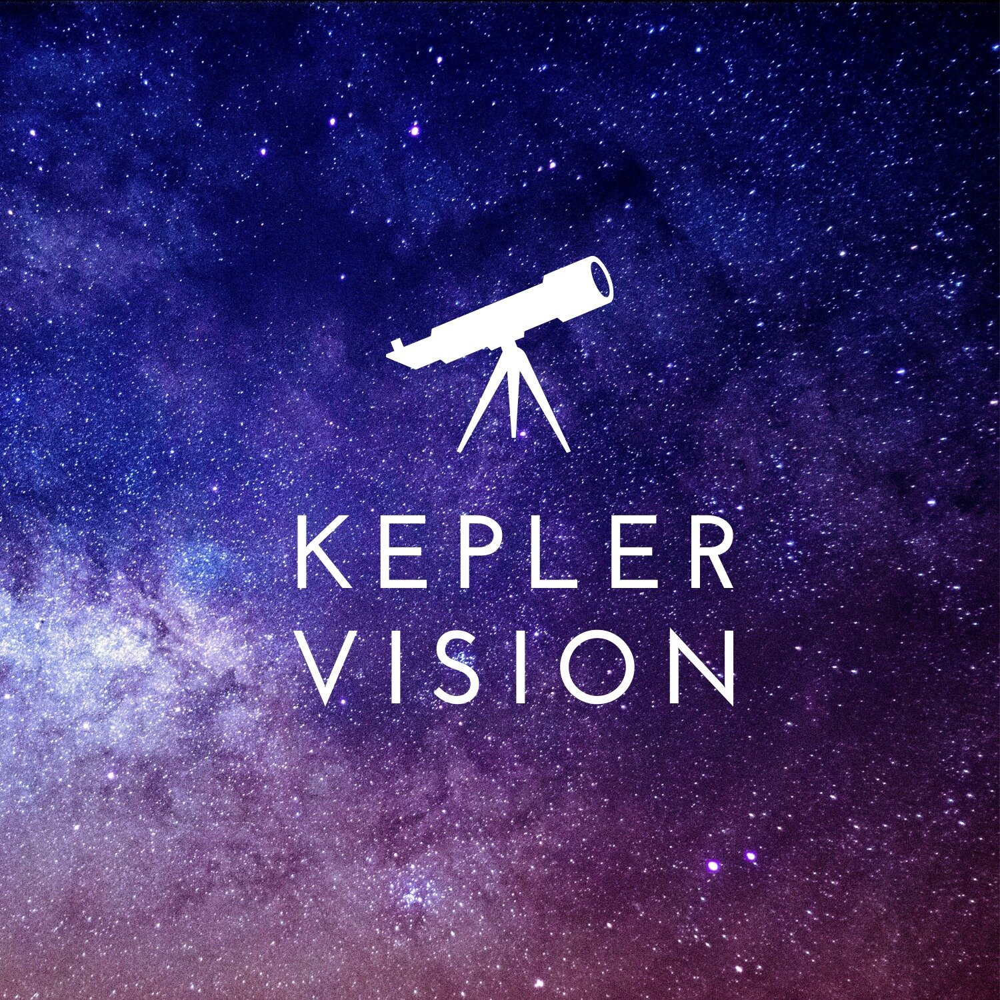

# Kepler Vision! (final project )
 Our project puts its focus on the ability to use modern data science technologies and artificial networks to give a quick and accurate classification of exoplanets in our Milky Way galaxy. In addition, analysis of information from space.
 

 ## Authors
 
 

**Dolev Hindy**

**Arad Zekler**

**Naor Dahan**

